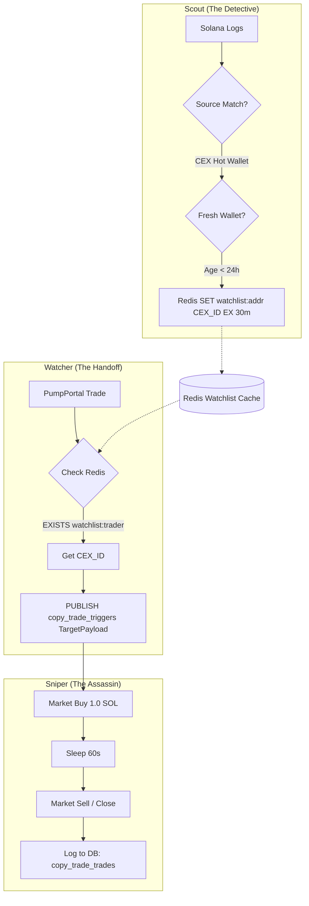

# CopyTrade Protocol: System Flow (Redis Watchlist Bridge)

The `copy_trade_protocol` leverages a high-speed Redis bridge to connect asynchronous liveness data (Scout) with real-time trade signals (Watcher).

## 🛰️ The Data Bridge

## 🧠 Core Component Logic

### 1. CopyTrade Scout
- **Detection**: Watches for `Transfer` instructions originating from known Binance, OKX, and Coinbase hot wallets.
- **Filtering**: If the destination wallet has very few transactions or was created recently, it is marked as a "Potential CopyTrade."
- **TTL Cache**: The wallet is stored in Redis for **30 minutes**. CopyTrade trades typically occur very shortly after funding.

### 2. CopyTrade Watcher
- **Throughput**: Watches every single PumpPortal trade.
- **Latency**: Performs an O(1) Redis lookup for every `trader` address.
- **State**: Does not maintain internal state of who is an copy_trade; relies entirely on the distributed Redis cache.

### 3. CopyTrade Sniper
- **Execution**: Receives a payload containing the `mint` and the `copy_trade_wallet`.
- **Transparency**: Every trade recorded in the database is tagged with the `funding_source` (e.g., `BINANCE_HOT_WALLET_4`), allowing us to audit which CEX flows are most profitable.

🏁 house on the moon
